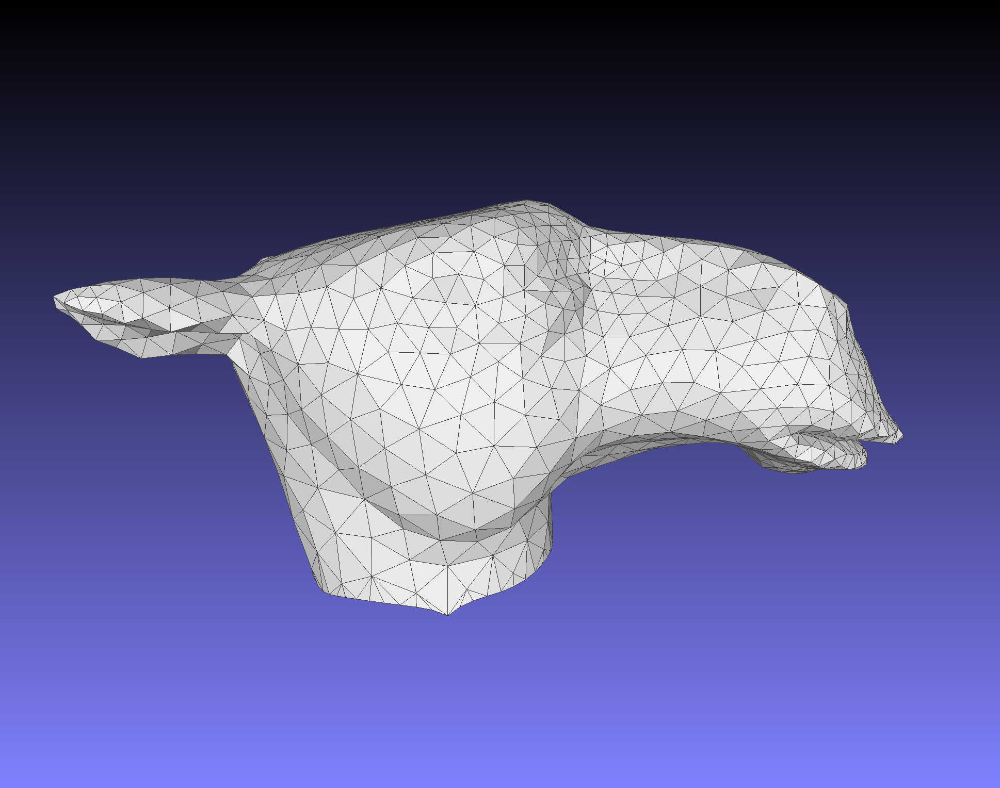

# Variational Remeshing

```
1. Conformal parameterization of input mesh
2. Compute local density
3. Perform in 2D parameter space
    3.1 Randomly sample according to local density 
    3.2 Compute CVD by Lloyd relaxation
4. Lift 2D Delaunay triangulation to 3D
```


# 0. Usage

```shell
mkdir build && cd build && cmake ../ && make -j4
./remeshing ../camelhead.off
```

- **Output**:

```
- uv.off						 	: Parameterization 2D parameter mesh
- initial_samples.off	: Random samples
- samples.off         : Final samples
- voronoi_overlap.off : Final colored overlapping between samples' voronoi cell and uv.off
- remeshed.off        : Lifted up triangle mesh
```


## 1. Conformal parameterization of input mesh

输入: 任意蝶形拓扑(Topological Disc)网格模型$M$, 即无环柄亏格为零且具有单个边界

输出: 将网格边界映射到单位圆周上，进一步通过LSCM(Least Square Conformal parameterization)求出共形映射UV二维平面坐标

具体实现，可参考依赖库pmp-library中的源码。我已将pmp-library的开边界lscm修改成圆周固定边界版本。

## 2. Compute local density

依照经典文献中的实现，将平面的密度函数定义为逐顶点定义的分片线性函数。将记顶点$v_i$的三维坐标为$p_i$, 二维参数化坐标为$uv_i$, 密度定义为顶点参数化前后的Voronoi局部面积比:
$$
d(i) = \frac{VoronoiArea(p_i)}{VoronoiArea(uv_i)}
$$

经典的实现中还会对密度函数进行低通滤波光滑处理， 这里暂不做光滑操作。

依据三角网格上逐顶点定义的分片线性密度函数，$uv_t$处的密度可以通过重心插值得到：
$$
d(uv_t) = \frac{bc_0*d(f_{v0}) + bc_1*d(f_{v1}) + bc_2*d(f_{v2})}{3}
$$
其中$bc, f_{v0},f_{v1},f_{v2}$分别为$uv_t$在参数平面上所在的三角形和相应的重心坐标(barycentric coordinate)。


## 3. Perform in 2D parameter space

### 3.1 Randomly sample according to local density 

关于采样点的初始生成，有很多说法和算法: 如不同网格遍历序列下的各种**floyd diffusion**。 用于构建CVT的Loyd算法求的是局部最优解，依据密度函数的随机拒绝采样能保证生成的采样点的密度与指导的密度函数一致，基础版密度随机拒绝采样如下：

```c++
vector<UVPoint> samples(n_samples);
for (auto i = 0; i < n_samples; ) {
		double u = uniform_random(0, 1);
    double v = uniform_random(0, 1);
    double d_uv = uniform_random(0, d_max);
    if(std::hypot(u, v) - 1 > float_eps || d_uv > d(u, v)) continue;
    samples[i++] = UVPoint(u, v);
}
```

由于各顶点的密度差异巨大，基础版密度随机拒绝采样会有大量的随机采样被拒绝。进一步算法可修正为随机生成三角形索引号、重心坐标、随机密度值, 从而完成快速的密度一致的随机点生成：

```c++
vector<UVPoint> samples(n_samples);
for (auto i = 0; i < n_samples; ) {
		auto f = pmp::Face(rand()%n_faces());
  	Eigen::Vector3f bc = Eigen::Vector3f::Random().cwiseAbs();
  	pmp::Point p = bc_interp(v2d_, f, bc/bc.sum());
    double d_uv = real_dis(gen);
  	if(d_uv > d(p[0], p[1]) ) continue;
  	samples[i++] = UVPoint(p[0], p[1]);
}
```

具体的实现参考代码中：**void VoronoiCellMesh::random_density_sampling(size_t n_sample)**

### 3.2 Compute CVD by Lloyd relaxation

- Compute Voronoi diagram of given points $p_i$
- Move points $p_i$ to centroids $c_i$ of their Voronoi cells $Cell_i$
- Repeat above steps until satisfactory convergence

$$
p_i \leftarrow c_i =  \frac{\int_{Cell_i} x\cdot \rho(x)}{\int_{Cell_i}\rho(x)}
$$

公式看着十分优雅简单，实际的离散积分的实现一言难尽。因为二维参数的密度差异过大，不能通过图像光栅的离散化方式计算积分。

于是直观的想法便是将参数化的平面三角网格与Voronoi Cell 网格求交：放到一起去。 编码实现依赖jc_voronoi和triangle两个开源库，jc_voronoi提供构建Voronoi图，triangle则可以用于含约束的三角网格生成。

```c++
PyMesh::TriangleWrapper triangle_wrapper;
triangle_wrapper.set_points(V);
triangle_wrapper.set_segments(E);
triangle_wrapper.set_triangles(F);
triangle_wrapper.set_min_angle(5);
triangle_wrapper.set_split_boundary(false);
triangle_wrapper.set_exact_arithmetic(true);
triangle_wrapper.set_max_num_steiner_points(0);
triangle_wrapper.run();
```

其中$V$为采样点、Voronoi Cell顶点和参数化网格顶点的并集，E为Voronoi Cell的边，F为参数化网格的三角面片索引。


#### 3.2.1 Compute Voronoi diagram of given points $p_i$

有了Overlapped的三角网格, 接下来只需要计算各色块的triangles的重心即可。连续形式的重心定义
$$
p_i \leftarrow c_i =  \frac{\int_{Cell_i} x\cdot \rho(x)}{\int_{Cell_i}\rho(x)}
$$
线性密度的三角形$v_i,v_j,v_k$的重心为

$$
c = \frac{v_i*d_i+v_j*d_j+v_k*d_k}{d_i+d_j+d_k}
$$


将每一个三角形视作质点，三角形的面积作为质点的质量，则有以下的离散化：

```c++
MatrixX2dr site_centroid = V_site_ * 1e-6;
Eigen::VectorXd mass = Eigen::VectorXd::Ones(V_site_.rows()) * 1e-6;
for(auto f: cell_mesh_.faces()) {
    if(f_region[f] == -1) continue;
    double face_area = pmp::triangle_area(cell_mesh_, f);
    for(auto v: cell_mesh_.vertices(f)) {
        auto p = cell_mesh_.position(v) * cell_v_density[v] * face_area;
        site_centroid.row(f_region[f]) += Eigen::RowVector2d(p[0], p[1]);
        mass[f_region[f]] += cell_v_density[v] * face_area;
    }
}
V_site_ = site_centroid.array().colwise() / mass.array();
```


```c++
/*
 * input: Samples
 * output: V, E
 * 依据Sample构建Voronoi Diagram, 并提取Voronoi Cell的顶点V和边E
 */
void voronoi_cell(MatrixX2dr& S, MatrixX2dr& V, MatrixX2Ir & E);

/*
 * input: V_tri, F, V_cell, E, V_sample
 * output: cell_mesh
 * Overlap参数化网格(V_tri, F)、VoronoiCell（V_cell, E)和随机采样点V_sample
 */
void mesh_voronoi_overlapping(MatrixX2dr& V_tri, MatrixX3Ir& F,
                              MatrixX2dr& V_cell, MatrixX2Ir& E,
                              MatrixX2dr& V_sample,
                              pmp::SurfaceMesh& cell_mesh);
```

## 4. Lift 2D Delaunay triangulation to 3D

```
1. 2D Delaunay triangulation
2. Lift-up: 2D -> 3D
```

Delaunay triangulation依然使用triangle库实现，将二维参数化网格的边界作为补充的点集和约束边集以保证Remeshed的边界完整性。

```c++
void triangulation(const MatrixX2dr& V, const MatrixX2Ir& E,
                   Eigen::MatrixX2d& V2, Eigen::MatrixX3i & F2);
```

Liftup则只需要计算当前采样点在参数平面上所在的三角形和相应的重心坐标，并通过三角形在原输入网格的三个顶点和重心坐标的插值即可得到当前采样点LiftUp之后的三维坐标点。

```c++
void VoronoiCellMesh::lift_up(Eigen::MatrixX3d& V, Eigen::MatrixX3i& F);
```



## References

[1. Report_Final_Project](https://mariosbikos.com/wp-content/uploads/2019/07/Report_Final_Project.pdf)

